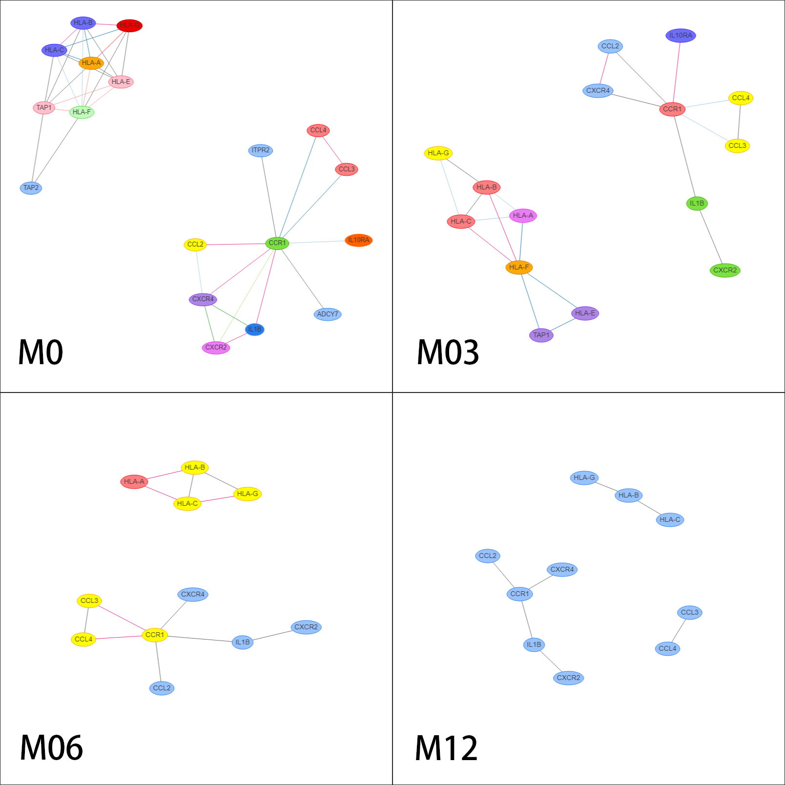
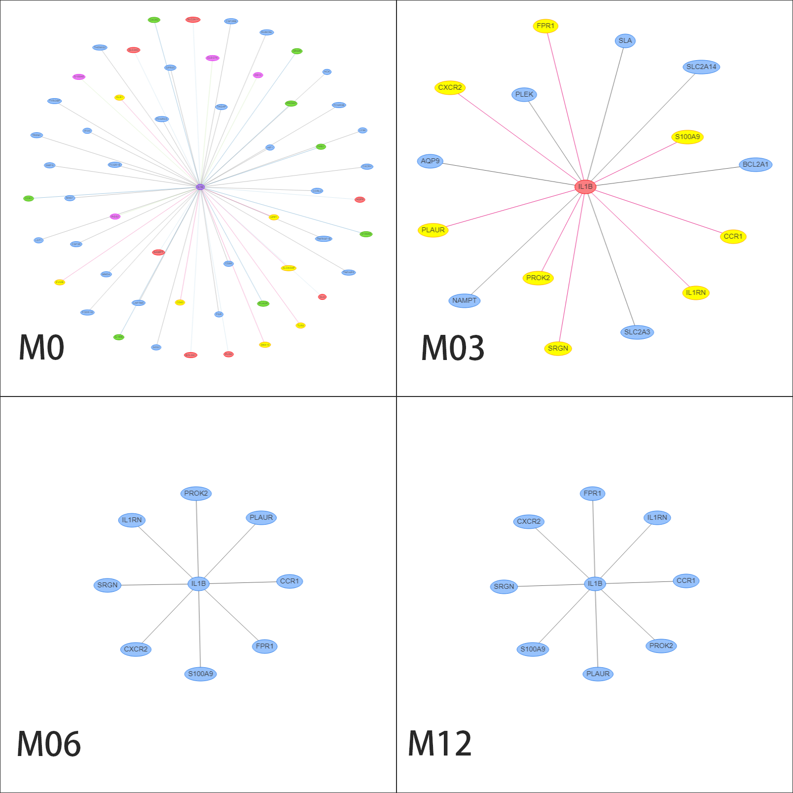
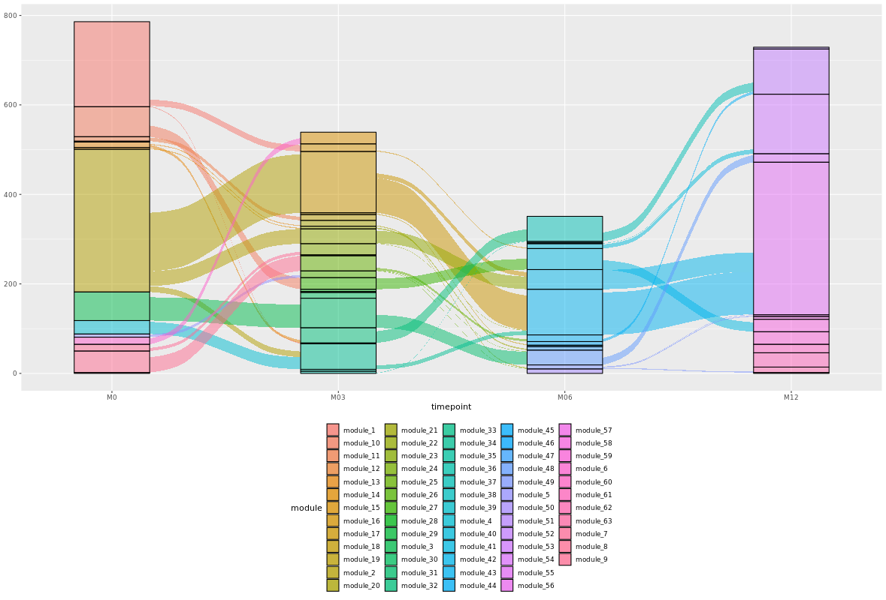

# DynBioNet
'DynBioNet' is a shiny app to visualize and explore dynamic (temporal) biological networks.<br>

> For more details on the importance of dynamic biological networks and some applications of 'DynBioNet', see: Huang, X. and Mora, A. (2021), DynBioNet –Understanding development and disease through visualization and analysis of dynamic biological networks (Under review).<br>

## 1. Installing DynBioNet:
There are three different ways to run DynBioNet:

### 1.1. From Github (using R):  https://github.com/mora-lab/DynBioNet<br>

Run the app directly from **R** using:
```R
library(shiny)
shiny::runApp("mora-lab/DynBioNet")
```

The previous commands will download data from [zenodo](https://zenodo.org/record/5336148#.YXoqPp7P2Uk) each time you run this app. Therefore, we recommand you to run this shinyApp using `shiny::runApp()` after downloading the repository to avoid the need to download data each time.

### 1.2. From Docker: https://hub.docker.com/r/moralab/dynbionet<br>

If you have installed Docker (here, [how to install Docker](https://github.com/mora-lab/installing/tree/main/docker)), run the following commands in a terminal:

```shell
sudo docker run -d \
    --publish=3838:3838 \
    --name dynbionet \
     moralab/dynbionet:latest
```

After running the previous commands, open your web browser and visit http://localhost:3838/DynBioNet/ to use the shiny app.<br>

> Note that the scripts of DynBioNet are located in the `/srv/shiny-server/` folder in the container.

### 1.3. From Virtual Machine: https://zenodo.org/deposit/5539480<br>

If you have installed the 'VirtualBox' Virtual Machine (here, [how to install VirtualBox](https://github.com/mora-lab/installing/tree/main/virtualbox)), download the file `DynBioNet-VM.ova` from [Zenodo]() and import this appliance to 'VirtualBox' (here, [how to import an .ova file](https://github.com/mora-lab/installing/tree/main/virtualbox_impo_expo)). 

After starting this Virtual Machine, log in using `moralab` as user and password, open the Firefox browser, and you will see the DynBioNet interface. As an alternative, visit the address http://localhost:3838/DynBioNet/.

> The scripts of DynBioNet are located in the `/srv/shiny-server/DynBioNet/` folder.

## 2. Uploading data:
This is the first tab of the app.<br>

### 2.1. Biological example (default data):
Our example (default data in the software) is a dynamic coexpression network built with expression data from three groups (non-smokers, healthy smokers, and smokers with COPD) and four time-points (0, 3, 6, and 12 months). The original data comes from: O'Beirne, S.L., et al. Ambient Pollution-related Reprogramming of the Human Small Airway Epithelial Transcriptome. Am J Respir Crit Care Med 2018;198(11):1413-1422 ([html](https://www.atsjournals.org/doi/10.1164/rccm.201712-2526OC), [pdf](https://www.atsjournals.org/doi/pdf/10.1164/rccm.201712-2526OC)).<br>

### 2.2. The input files:
DynBioNet receives four input files: `design file`, `expression data file`, `edges (network) file`, and `module file`.

- **Design file** is a CSV file which contains the `sample`, `group` and `timepoint` columns. The `timepoint` column should contain the names of the time-points, whcih should be ordered. For example, `month zero`, `month 3`, `month 6` and `month 12`, became `M0`, `M03`, `M06`, and `M12`.<br>
- **Edges (network) file** is a CSV file with the network represented as an edge list, including the `fromNode`, `toNode`, `weight`, `timepoint`, and `group` columns. We recommend using SYMBOL gene identifiers for `fromeNode` and `toNode`. The `Edges file` can be obtained from the function `exportNetworkToCytoscape()` of the `WGCNA` package, or from any graphical package in `R` such as `graph` or `igraph`.<br>
- **Expression data file** includes gene expression data that will be used to build the violin plot of each gene. The first column is `gene`, which uses the same gene identifier than the `edges file`.<br>
- **Module file** is a description of the subnetworks that the user wants to analyze, and it is mainly used to plot the alluvial diagram. The module file has the `nodeName`, `timepoint`, `group` and `module` columns.<br>

We have built some examples of input files at https://zenodo.org/record/5336148#.YXoqPp7P2Uk. The four input files are called `example-design.csv`, `example-edges.csv`, `example-exprs.csv`, and `example-module.csv`, respectively. After you submit all files (press `Submit` button of the page `Upload your data`), an sql database will be built by the software. You can find an example of such database at https://zenodo.org/record/5336148#.YXoqPp7P2Uk, which is called `COPD-data.sqlite`. Finally, we can find an additional sql file, called `kegg_GO_info.sqlite`, which contains annotation info from KEGG and GO.<br>

### 2.3. Browsing the four input files from DynBioNet:
After you submit all files (press `Submit` button of the page `Upload your data`), the corresponding files will be displayed as tables on the right side of the screen. Note that the size of each input file has been set to a maximum of 500MB in the `global.R` file.<br><br>

*Insert figure here*

## 3. KEGG pathway and GO term subnetwork analysis:
This is the second tab of the app.<br>

### 3.1. Goal and example:
Our first goal is to check the evolution of the dynamic networks inside a given pathway or GO term along time in our example (default) dataset.<br>

From our study case, we have chosen the `COPD smoker` group, the `Human cytomegalovirus infection` KEGG pathway, and the `genes to genes` view, to show an example of DynBioNet visualizations.<br>

The following is an example of the plots generated under such conditions:<br>



### 3.2. Input data. <br>
The following are the basic input commands of the `KEGG` and `GO` tab:<br>

- **Select your data**: It is possible to set a name for your project, and then you can switch between different datasets/projects. For example, you can observe that our default dataset is called `COPD-data`.
- **KEGG ID or KEGG pathway**: You can input one or more KEGG IDs (or pathway names) to extract such subnetwork from the full network. If you don't input a KEGG ID or description, the software will choose the entire network.
- **GO ID or GO term**: You can input one or more GO IDs (or GO terms) to extract such subnetwork from the full network. If you don't input any GO ID or GO term, the software will choose the entire network.
- **Groups**: You should select one or more of the different groups that are being compared in the experiment, which are extracted from the `group` column in the uploaded `design file`. 
- **Timepoints**:  You should select one or more time-points, which come from the `timepoint` column in the `design file` you uploaded. 
- **Weight:** The value of the weight of the edges (in our example, the correlation coefficient between the two nodes) can be used as a threshold to decide if an edge should be included or removed from the graph. The slider can be used to set maximum and minimum values (in our example, an edge should appear if 0.50 < r < 1.00, and no edge should appear if r < 0.50, but smaller values can also be accepted depending on the analysis). The weight values come from the `weight` column in the `edges file`. If the `weight` column is not included in the `edge file` (unweighted network), the slider will not be shown. The same chosen weight thresholds will be valid for all groups and all time-points.
- **Plot**: There are three plotting options. `genes to genes` plots edges from genes to genes. `genes to KEGG` plots edges from genes to KEGG pathways. `genes to GO` plots edges from genes to GO terms. You can choose one or more options. If you don't choose any option, no network will be plotted.

### 3.3. Network visualization:<br>
The network visualization is built using the `visNewtwork` R package. Among the visualization properties, we highlight:

- **Zoom in and zoom out**.
- **Hover over nodes and edges**: When your mouse hovers over nodes or edges, it will show you the node or edge details.
- **Move nodes**: You can drag and move nodes in any way you want.
- **Edit**: When you select one node and click `Edit`, you will get the options `Add Node`, `Add Edge`, `Edit Node` and `Delete selected` node. When you select one edge, you can `Add Edge`, `Edit Edge` and `Delete selected` edge.
- **Colors**: In the case you select one only group, nodes and edges have colors that indicate time-point-related information. Different edge colors represent a different edge type (for example, if edge1 is found in M03 and M06, edge2 the same, edge3 in M06 only, and edge4 in M06 and M12, that means that edge1 and edge2 will have the same color, different to edge3 and different to edge4). On the other hand, nodes with the same color represent nodes that share the same types of edge types (for example, if node1 has red edge and blue edge, node2 the same, node3 only blue edge, and node4 only red edge, then the two first nodes will have the same color, different to the third and fourth. Edge types, and colors, are extracted from the `timepoint` columns in `edge file` for a given group.
- **Download image**: You can download a `png` file with your subnetwork.

### 3.4. Results:<br>
Results can be found at the bottom of the shiny interface.

### 3.4.1. Node information:<br>
`Node information` includes `Gene Node` information, `KEGG Node` information, `GO Node` information, and a `Gene Expression` subtable.

- **Gene Node**: the information of the genes in the subnetwork.
- **KEGG Node**: the information of the KEGG pathways in the subnetwork.
- **GO Node**: the information of the GO terms in the subnetwork.
- **Gene Expression**: Using data from the `expression data file`, shows a violin plot when your mouse hovers over a gene node in the subnetwork.

### 3.4.2. Edge information:<br>

- **Edge information** records all edge information in the subnetwork. 

### 3.4.3. Network coordination scores:<br>

The tab collect genes number, KEGG number, GO number, edges number and others.

### 3.5. Download:<br>

The `Download`  tab supports download excel file of `gene nodes`,  `KEGG nodes`, `GO nodes` and `edges`  information.

## 4. Gene neighborhood analysis:
This is the third tab of the app.<br>

### 4.1. Biological example.<br>

The networks for `IL1β` genes over time with COPD smoker group. 



### 4.2. Input data.<br>

- **Select your data**: Same of `Select your data` in the part `3.2. Input data`
- **Gene symbol or entrezid**: Specify one or more genes to obtain the relationships associated with them.
- **Groups**: Same of `Groups` in the part `3.2. Input data`
- **Timepoints**: Same of `Timepoints` in the part `3.2. Input data`
- **Weights**: Same of `Weights` in the part `3.2. Input data`
- **Plot**: Same of `Plot` in the part `3.2. Input data`

### 4.3. Network visualization.<br>

Same of the part `3.3. Network visualization`.

### 4.4. Node information.<br>

Same of the part `3.4. Node information`.

### 4.5. Edge information.<br>

**Edge information** record all edge information in the network. 

### 4.6. Network coordination scores.<br>

The tab collect genes number, KEGG number, GO number, edges number and others.

### 4.7. Time neighborhood membership.<br>

Specify one gene neighborhood memberships over time with specify group in one table.

### 4.8. Download.<br>

The `Download`  tab supports download excel file of `gene nodes`,  `KEGG nodes`, `GO nodes` and `edges`  information.

## 5. Alluvial diagram:
This is the fourth tab of the app.<br>

The alluvial diagram depicts the changes in the clustering of genes over time with specify group.



## 6. Troubleshooting:
A list of possible problems:<br><br>

### DynBioNet VM:
* Error "Change Network Settings": In VirtualBox, go to Settings -> Network, and make 'Attached to'='NAT'.
* Error "Failed to open a session" (E_FAIL): Known problem with VirtualBox 6.1.28 (better install v 6.1.26 or earlier).

## 7. How to cite DynBioNet:
Huang, X. and Mora, A. (2021), DynBioNet –Understanding development and disease through visualization and analysis of dynamic biological networks, Under review.<br>
 
## 8. Help us improving DynBioNet:
### 8.1. Report bugs:<br>
You can report any bugs or mistakes to our email:<br>
Huang Xiaowei: h15016211223@163.com<br>
Antonio Mora: antoniocmora@gzhmu.edu.cn<br> 

### 8.2. Adding new functionality:<br>

* `global.R` file: This file calls the required libraries and install the data files if they haven't been installed yet. Please update it if you are using new libraries or installing new datasets.<br>
* `server.R` file: This file included all server functions for the DynBioNet.<br>
* `ui.R` file: This file defined all interface for the DynBioNet.<br>
* `ui folder`: This folder contains one R script for each of the current tabs of DynBioNet, which contain the main computations for each tab. If you add a new tab, please add a new R file here.<br>
* `Functions folder:` This folder contains all the functions for very specific tasks such as getting data or plotting data, which are called by the main routines. Place here any new function that will be called by the main routines.<br>

*Last reviewed: Oct. 29th, 2021*
